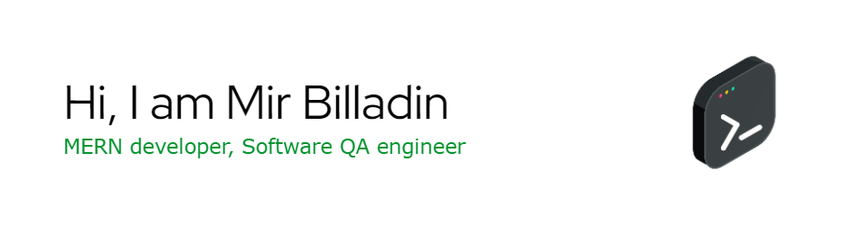
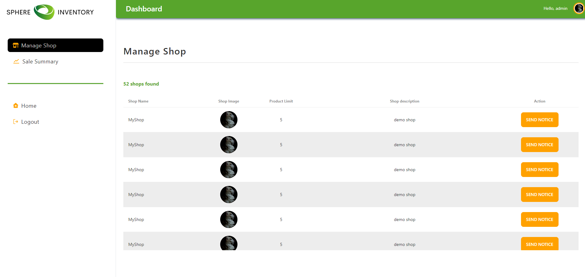
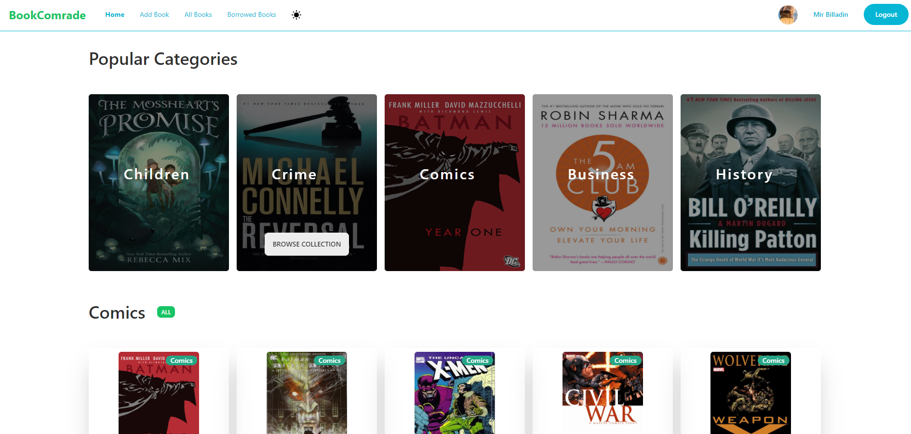
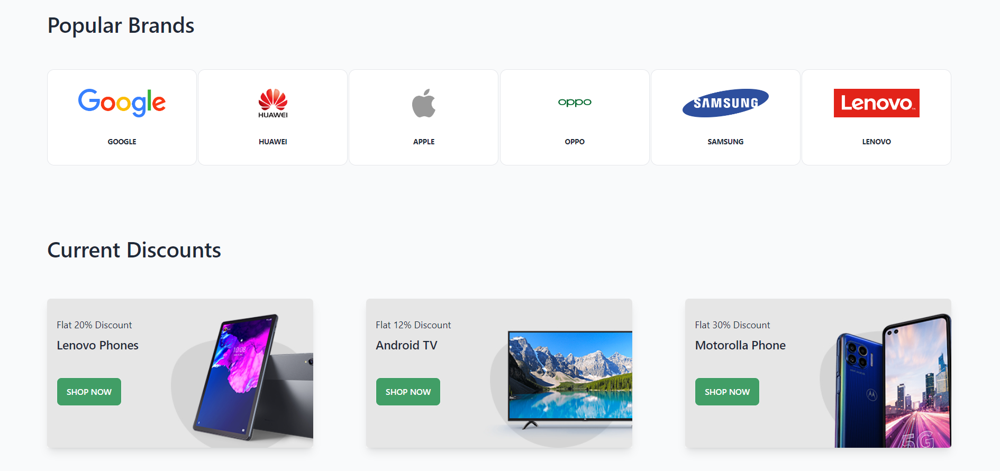

  

### About Me :man_technologist:
I'm a software QA engineer and a new MERN stack developer, currently gaining valuable experience in MERN ecosystem.

- :telescope: Working as a Software QA Engineer and contributing to maintain software quality.

- :seedling: Ready to contribute my newly acquired MERN skills in any forntend or backend project

### Technologies :hammer_and_wrench:

  

### Current Stats 📈

  

 

## Pinned repos 📌

### Sphere Inventory
Features:
- Role based access control on Admin/Manager/User account
- Manage products (add/edit/delete)
- Order management with receipt (PDF)
- Buy plan to upgrade shop limit
- Stripe payment

    

### Book Comrade
Features:
- Role based access control on Admin/Manager/User account
- Manage products (add/edit/delete)
- Order management with receipt (PDF)
- Buy plan to upgrade shop limit
- Stripe payment

    

### ElectroniX
Features:
- Role based access control on Admin/Manager/User account
- Manage products (add/edit/delete)
- Order management with receipt (PDF)
- Buy plan to upgrade shop limit
- Stripe payment

    

## Contact me :speech_balloon:

:e-mail: <a href="mailto:mir.billadin4@gmail.com">Send an e-mail</a>

:globe_with_meridians: <a href="https://www.upwork.com/freelancers/~01449a1f318b43c81d">Visit my upwork profile</a>

